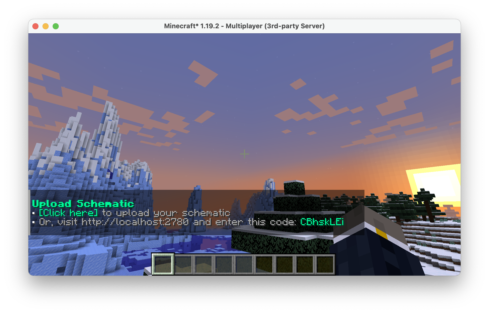

# SchematicUpload

**SchematicUpload** is a plugin that lets players upload schematics to your server through a simple and safe web panel.
If you've ever run a build or creative server and have had to respond to annoying requests to import a player's
schematic, this is the plugin for you.

## How it works

Players simply type the `/schematicupload` command in-game that sends them a link to the web panel with a unique
authentication code. On the panel, all the player needs to do is choose the file and press "Upload". The schematic will
be checked and uploaded to the schematics' folder in-game.

## Features

* Incredibly simple to use web interface
* Super easy to configure, just choose your port and hostname
* Limit the file size of schematics that can be uploaded
* Limit how many schematics a player can upload over a given timeframe

## Screenshots

## Commands

SchematicUpload provides the following commands. By default, only operators are permitted to use the schematic uploader.
You'll need a permission plugin such as LuckPerms to let non-operators use these.

| Command                   | Description                                       | Permission                       |
|---------------------------|---------------------------------------------------|----------------------------------|
| `/uploadschematic`        | Upload a schematic file through the web interface | `schematicupload.command`        |
| `/uploadschematic about`  | View plugin information                           | `schematicupload.command.about`  |
| `/uploadschematic reload` | Reload config and message files                   | `schematicupload.command.reload` |